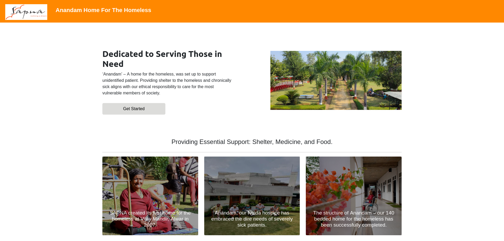
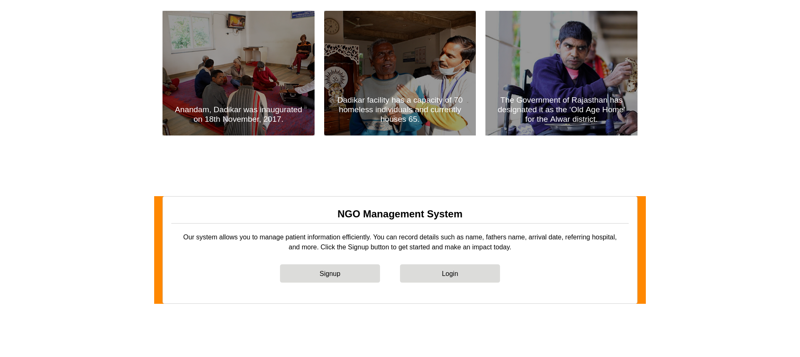
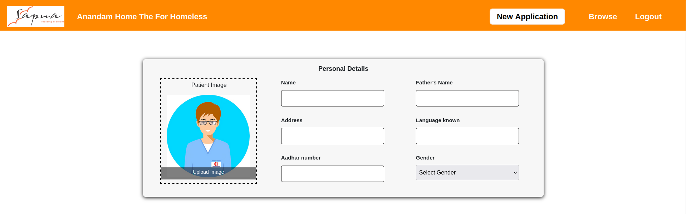
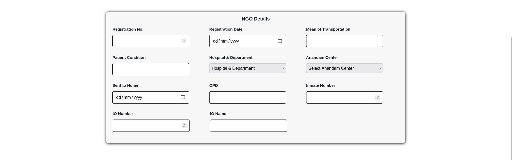
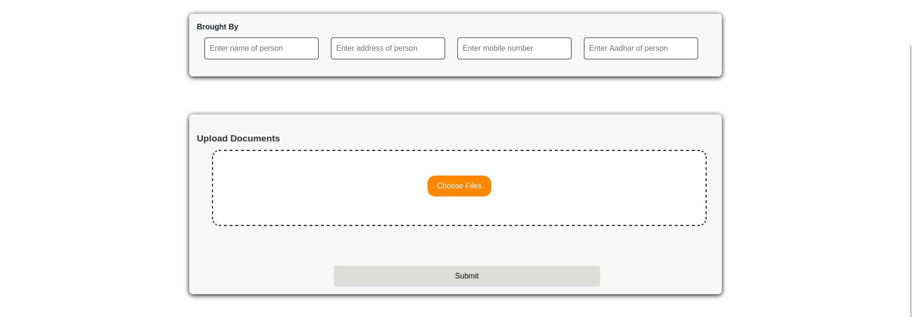
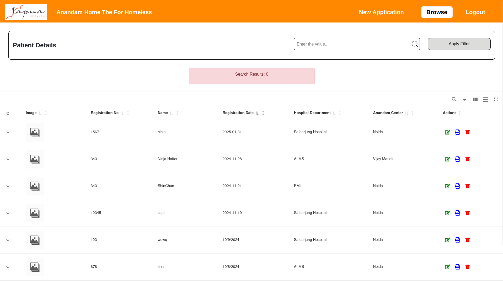
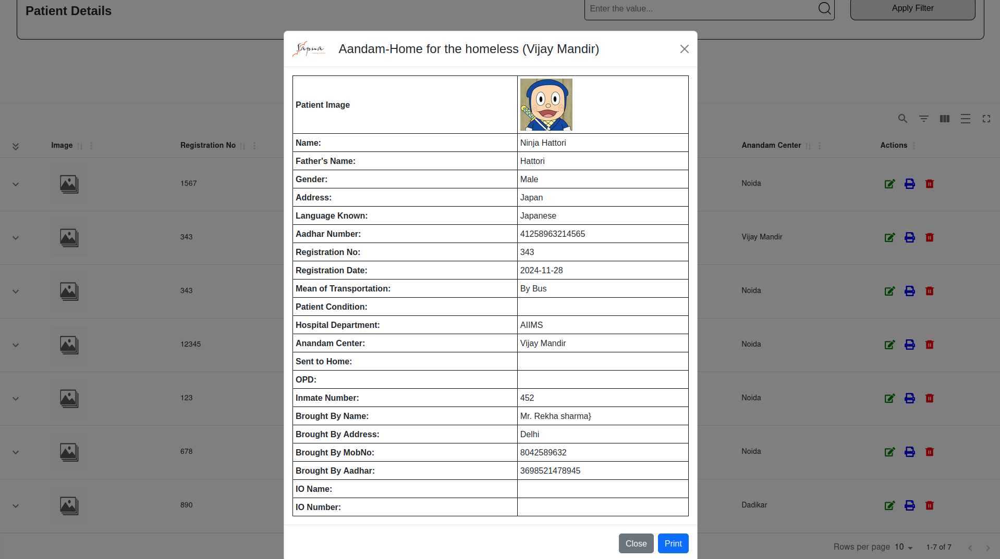
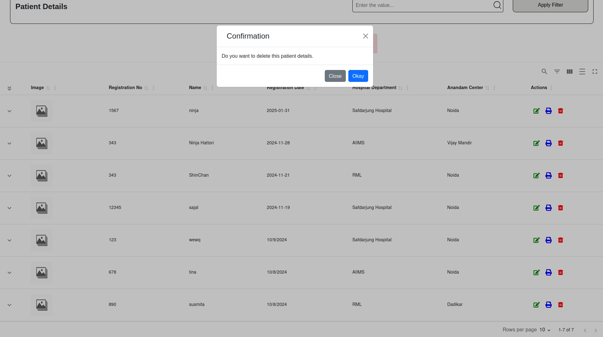
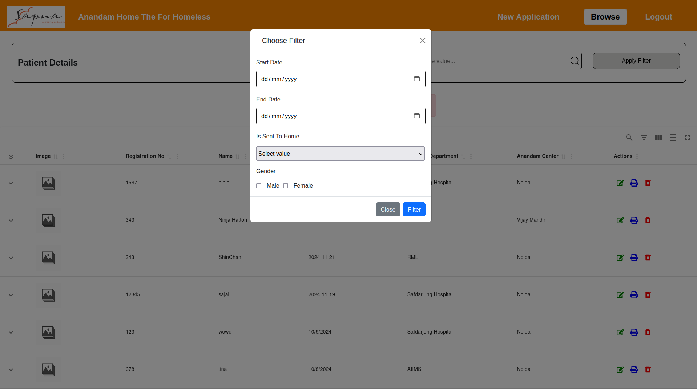
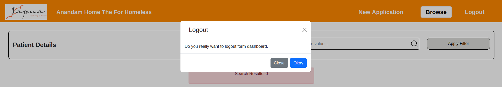

# NGO Management System

## Introduction
The **NGO Management System** is a web-based application designed to efficiently manage patient records. This system allows users to add, edit, delete and browse patient details while ensuring secure access through authentication.

## Features
### 1. Home Page
- New users can **sign up** or **log in** to access the NGO Management system.
- Secure authentication using **Firebase authentication** 




### 2. Patient Details Page 
- Users can **add patient details** using a structured form. 
- The form is divided into **three sections**: 
1. **Personal Details** (Name, Age, Gender, Contact Info, etc.)


2. **NGO Details** (Patients Reg. Date, Inmate number, OPD number, etc.)


3. **Upload Documents** (Medical Reports, Aadhar Card, etc.)



### 3. Browse Patients
- View all patients in a **tabular format**.


- Perform **search, edit, delete, and print** operations on patient records.

 





### 4. Logout 
- Secure Logout, Clear cache.



## Tech Stack
- **Frontend:** React.js (Create React App)
- **Backend:** Node.js & Express.js
- **Database:** MongoDB (Mongoose ODM)


#### Starting the Client
```sh 
#Navigate to client folder
cd ngo_portal/client 
# Install Dependencies 
npm install 
# Start the client
npm run dev
```

#### Starting the Server 
```
# Navigate to the server folder
cd ngo_portal/server

# Start the server
node index.js
```